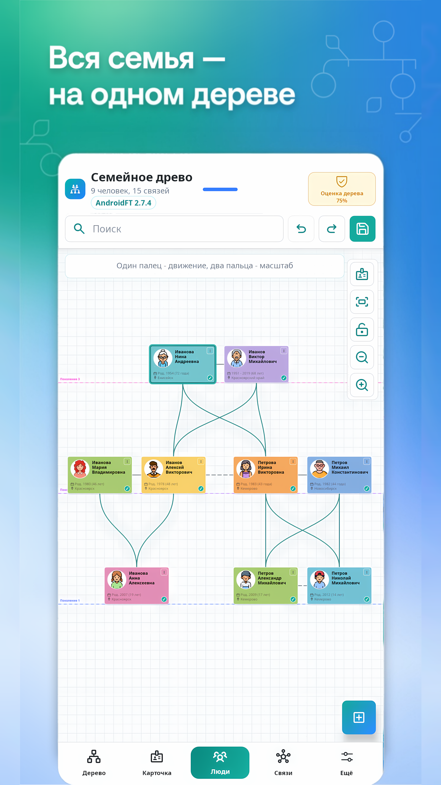
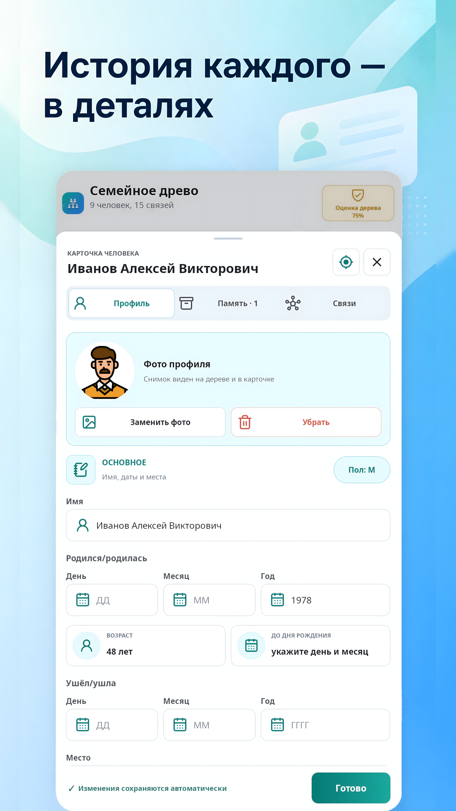
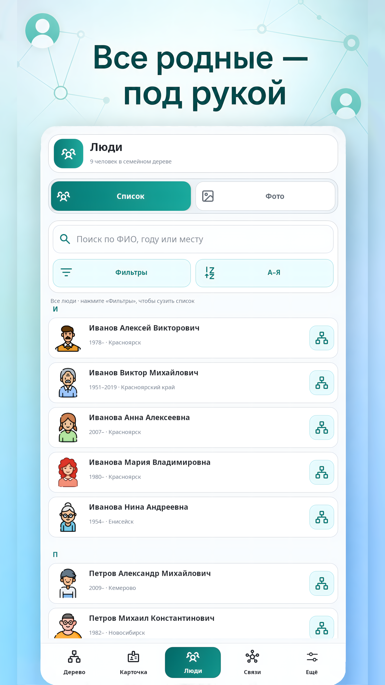
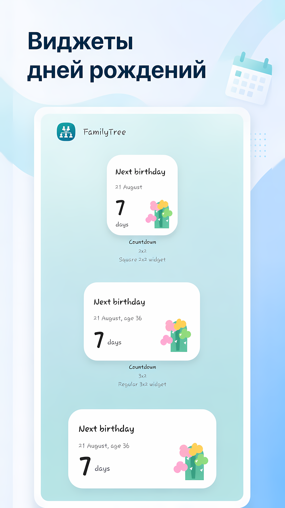

# Дзен: Как собрать семейное дерево на телефоне и не потерять истории родных

Семейная история часто хранится не в архиве, а в случайных местах. Старые фото лежат в галерее и чатах, документы - в папках, даты дней рождения - в памяти родственников, а важные истории вообще нигде не записаны.

Со временем это становится проблемой. Мы помним имена ближайших родных, но уже хуже понимаем, кто кому кем приходится, где жили старшие поколения, какие были семейные истории и какие фотографии к ним относятся.

Для этого я сделал **Family Tree DS** - Android-приложение для семейного дерева и семейного архива.

## Что такое Family Tree DS

Это приложение, в котором можно создать семейное дерево, добавить родственников, указать связи между ними и сохранить важные данные о каждом человеке.

У человека может быть карточка с фото, датами, местом, заметками, историями и документами.

Так дерево становится не просто схемой, а настоящим семейным архивом.

## Что можно хранить

В Family Tree DS можно добавить:

- имя и фамилию родственника;
- фотографию;
- дату рождения;
- дату ухода;
- место;
- заметки;
- семейные истории;
- документы;
- дополнительные фотографии;
- связи с другими людьми.

Есть отдельный раздел со списком всех людей. Он помогает быстро найти нужного родственника по имени, году или месту.

## Почему приложение работает локально

Семейные данные - личные. Поэтому базовый сценарий Family Tree DS не требует регистрации, подписки или обязательного облака.

Дерево хранится на телефоне. Его можно перенести одним `.ftree` файлом, отправить родственникам, сохранить как резервную копию или экспортировать в другие форматы.

Поддерживаются:

- `.ftree` для переноса всего дерева;
- GEDCOM для обмена с генеалогическими программами;
- PDF для печати;
- PNG для изображения дерева;
- JSON для дополнительного экспорта.

## А если нужно общее дерево для семьи

В приложении есть необязательный онлайн-режим. Он использует приватный GitHub-репозиторий пользователя. Можно подключить родственников по приглашению и выбрать, кто может только смотреть, а кто может редактировать дерево.

Это не обязательная часть приложения. Можно пользоваться Family Tree DS полностью локально.

## Виджеты дней рождения

Отдельная полезная функция - виджеты ближайших дней рождения.

Они помогают не забывать о важных семейных датах и делают дерево полезным не только во время редактирования.

## Кому подойдёт приложение

Family Tree DS подойдёт тем, кто:

- хочет начать семейное дерево с телефона;
- собирает родословную;
- хранит семейные фотографии;
- хочет записать истории старших родственников;
- хочет передать архив детям и внукам;
- не хочет зависеть от платного облачного сервиса.

Скачать приложение: https://www.rustore.ru/catalog/app/ru.drshapaya.familytree

Сайт: https://family-tree-ds.fischerrusso80376bun.chatgpt.site

GitHub: https://github.com/DrShapaya/Family-Tree-DS

Telegram-канал: https://t.me/FamilyTreeDS

Telegram-чат: https://t.me/ChatFamilyTree

Если вы давно хотели собрать семейное дерево, можно начать с малого: добавьте себя, родителей, бабушек и дедушек. Даже такое маленькое дерево уже помогает увидеть семейную историю понятнее.

